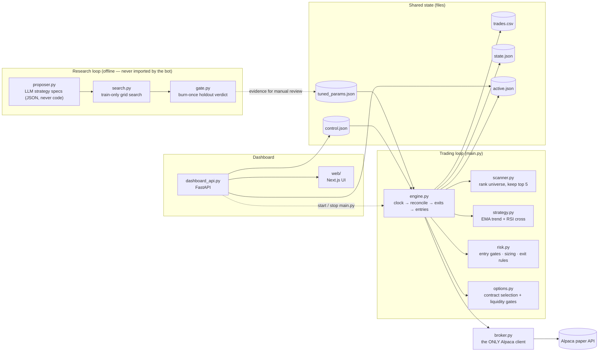

# Options Paper-Trading Bot

[](https://github.com/Manideep728/trading_bot_new/actions/workflows/ci.yml)

Automatic options trading bot for an **Alpaca paper account**. It watches a
30-name universe with a **two-tier scan**: every 30 minutes it ranks the whole
universe for "likely to produce a tradeable signal soon" and keeps the top 5;
every 30 seconds it polls just those 5, computes EMA/RSI, and — when the strict
rules line up — buys a single call or put with a marketable limit order, then
manages the exit. Long options only: maximum possible loss on any trade is the
premium paid.

**Paper trading only.** The broker client is hard-wired to Alpaca's paper
endpoint. Nothing here is financial advice; the strategy is a disciplined
skeleton with **no proven edge** (see Backtesting below for the honest
numbers), designed so the risk caps contain the damage while evidence
accumulates.


## Architecture



## Strategy (defaults in `bot/config.py`, tunables in `tuned_params.json`)

**Universe & two-tier scan** — the watchlist is 30 names: ~10 liquid index/
sector ETFs plus ~20 mega-caps (for movement and to decorrelate the
shortlist). Scanning them all every 30 s would be slow, so:

- **Rank tier (every 30 min):** score all 30 on `score = trend_clarity ×
  rsi_proximity × recent_volatility` (`bot/scanner.py`) — "primed to fire"
  weighted by "actually moving." Keep the top 5 as the active shortlist.
- **Poll tier (every 30 s):** evaluate only those 5 for entries.
- **Trade cooldown:** once a signal fires on a `(symbol, action)` it is
  suppressed for `signal_cooldown_sec` (30 min), so a fast poll can't
  re-trigger the same setup every cycle.
- **Earnings blackout:** single names within `earnings_blackout_days` (±3) of
  earnings are dropped from the shortlist — an overnight earnings gap can open
  straight through the stop. Dates come from a hand-maintained `earnings.json`
  (see `earnings.example.json`); ETFs and unlisted symbols are never blacked
  out.

**Entry** — evaluated per shortlisted symbol on the latest closed 15-minute
bar:

| Condition | Buy CALL | Buy PUT |
|---|---|---|
| Trend filter | EMA-fast > EMA-slow | EMA-fast < EMA-slow |
| Trigger | RSI(14) crosses **up** through the bull level | RSI(14) crosses **down** through the bear level |

The default RSI levels are 45/55, not the textbook 30/70 — measured on a year
of real SPY/QQQ 15-minute data, RSI almost never reaches classic extremes
while the trend filter agrees; 35/65 produced literally zero signals.

Contract picked: nearest expiry within **7–14 DTE**, first strike OTM, and it
must pass liquidity gates (bid > 0, spread ≤ 10% of mid, open interest ≥ 100).
Entries use a **marketable limit** (mid + 1%, capped at the ask); exits sell
with a limit at the bid. Unfilled orders are canceled after 120 s.

**Exits** (checked every loop, priced on the **bid**, not the mark): take
profit **+50%**, stop loss **−25%**, time stop at **≤ 2 DTE**, max hold
**2 days** (entry time from the trade journal).

**Risk gates** (hard — the self-tuner cannot touch these): max 3 open
positions, 1 per underlying, premium ≤ 2% of equity, max 3 new trades/day,
and a **daily circuit breaker** that halts new entries if the account is down
4% from yesterday's close. No entries in the first/last 15 minutes.

## Setup

```powershell
python -m venv .venv
.venv\Scripts\pip install -r requirements.txt
copy .env.example .env   # then edit .env
```

Get free **paper** API keys: sign up at https://alpaca.markets, open the
dashboard, switch to **Paper Trading**, and generate an API key pair. Put both
values in `.env`.

## Run

```powershell
.venv\Scripts\python main.py
```

- `DRY_RUN=true` (default): full pipeline with real market data; orders are
  **logged, not submitted**. Start here.
- `DRY_RUN=false`: orders are submitted to your **paper** account.

Every cycle logs the shortlist's indicator readings and the decision reason
(enter / skip / hold / exit) to the console and `bot.log`, and each re-rank
logs the new top-5 with their scores. Daily trade counts
survive restarts via `state.json`; every fill is journaled to `trades.csv`
with FIFO-matched realized P&L.

## Dashboard

The repository now includes a local web dashboard in `web/` and a small
FastAPI backend in `dashboard_api.py`.

```powershell
cd web
npm run dev
```

`npm run dev` boots the FastAPI backend automatically (reusing it if it's
already running on `:8000`) alongside the Next.js frontend, so opening the
dashboard never needs a second terminal. **Opening the dashboard does not
start the trading loop** — `main.py` only runs once you explicitly start it.

Equivalently, `.venv\Scripts\python run_dashboard.py` still launches the API
and frontend together from the Python side, without npm.

The dashboard reads live bot state from the API and shows the current signal
and risk reasoning for the **active shortlist** (the top-ranked names the
engine is actually polling, read from `active.json` — so a refresh costs a
handful of data calls, not one per universe symbol), plus two separate sets of
controls:

- **Bot process** — Start/stop the trading loop (`main.py`) itself as an OS
  process. This is the on/off switch; nothing trades while it's stopped.
- **Entry gate** — Pause/resume new entries on an already-running bot without
  touching exits, plus canceling orders and closing positions.

## Backtesting & self-tuning

```powershell
.venv\Scripts\python backtest.py --days 365          # replay current params
.venv\Scripts\python backtest.py --days 365 --tune   # guarded self-tuning
```

The backtester replays the exact live signal rules over historical bars with
an explicit option-P&L approximation (delta gearing, theta decay, spread
costs — constants in `bot/simulator.py`). `--tune` grid-searches the signal
and exit parameters under **hard guidelines** (`bot/tuner.py`):

1. Risk caps are not in the search space at all.
2. Every candidate value is clamped into `TUNABLE_BOUNDS` — twice.
3. ≥ 30 trades required on both the train and validation windows.
4. The winner is selected on **training** expectancy, then checked exactly
   once against validation: it must have positive validation expectancy AND
   beat the current parameters' validation expectancy by ≥ 10%. (Ranking
   candidates by validation score — and then reporting that same score as
   the evidence — is selection bias: across ~200 grid candidates the best
   validation score would be partly luck. Selecting on train and touching
   validation only once for the winner keeps it an honest out-of-sample
   check.)

Accepted changes are written to `tuned_params.json` **with their evidence**;
the bot applies them (re-clamped) on next start. If nothing qualifies, the
current parameters stand.

**Honest numbers** (365 days ending 2026-07-07, all costs modeled): default
params full-period expectancy was **−2.9%** of premium per trade across 117
trades — i.e. no demonstrated edge. The `tuned_params.json` checked into this
repo has evidence (+15.65% validation expectancy, 46 trades) generated by an
earlier version of the tuner that selected its winner on the validation
window itself — selection bias inflates that number, so treat it as stale.
Re-run `backtest.py --tune` to regenerate evidence under the corrected
train-then-validate selection above.

## Research loop (`research/`)

A guarded self-improvement pipeline, separate from the live bot (the engine
never imports it). The cycle:

```powershell
.venv\Scripts\python -m research fetch            # cache bars once; splits off a quarantined holdout
.venv\Scripts\python -m research search --family baseline   # select on TRAIN, judge on validation
.venv\Scripts\python -m research report           # failure analysis of train trades (you read this)
.venv\Scripts\python -m research robustness       # simulator-perturbation + daily regime checks
.venv\Scripts\python -m research gate             # burn-once out-of-sample verdict
```

Families: `baseline` (live EMA+RSI), `ema_slope`, `donchian`, `rsi_only`
(control). Honesty machinery: every candidate ever scored is logged to an
append-only `research/trials.jsonl`; the acceptance score is a **deflated
Sharpe** (your Sharpe vs. the best of N logged tries); the holdout window is
**burned** after one gate attempt — pass or fail — and a repeat is refused
until new data accrues. A gate pass prints evidence for *manual* review;
nothing auto-deploys, and risk caps are not in any search space.

**Phase 2 — the LLM proposer.** `python -m research propose` sends the
failure report + trial history to Claude, which proposes the next family as
a JSON **spec** — a combination of fixed building blocks (`research/blocks.py`:
trend x trigger x entry filters such as `max_entry_vol`, `entry_hours`,
`calls_only`), never code. Specs are validated, clamped into bounds, capped
in grid size, and searched via `search --spec research/proposals/<name>.json`
through the identical pipeline with full registry logging. Requires
`ANTHROPIC_API_KEY` in `.env`; without one, `propose --offline` writes the
exact prompt to `research/proposal_prompt.txt` for any LLM (or you) to answer.
The gate stays human-invoked and burn-once regardless of who proposed.

## Tests

```powershell
.venv\Scripts\python -m pytest tests -q
```

102 tests cover the indicator math (including a known Wilder RSI value),
signal triggers, contract filters, every risk gate, journal P&L matching, the
simulator (verified bar-for-bar identical to the live signal logic), the
tuner guardrails (clamping, non-tunable risk caps, thin-evidence rejection),
the scanner scoring/ranking, the earnings blackout, the active-shortlist
persistence, the dashboard snapshot (shortlist-only polling), and full engine
cycles against a fake broker (entries, exits, order reconciliation, stale-order
cancels, max-hold via journal, two-tier ranking, cooldown, blackout).

## Layout

```
main.py            entry point (logging, config validation, loop start)
backtest.py        backtest / self-tune CLI
bot/config.py      every tunable + TUNABLE_BOUNDS + clamped tuned-param loading
bot/indicators.py  EMA / Wilder RSI (pure math)
bot/scanner.py     universe ranking: hybrid vol-weighted "primed" score (pure)
bot/strategy.py    signal logic (pure)
bot/earnings.py    earnings blackout gate + earnings.json loader
bot/options.py     contract selection + liquidity gates (pure)
bot/risk.py        entry gates, sizing, exit rules incl. max hold (pure)
bot/simulator.py   backtest engine + option P&L model (pure)
bot/tuner.py       guarded grid search + walk-forward validation
bot/journal.py     trades.csv fill journal, FIFO realized P&L
bot/state.py       daily counters persisted to state.json
bot/watchlist.py   active shortlist persisted to active.json (engine -> dashboard)
bot/control.py     pause/resume flag shared with the dashboard
bot/dashboard.py   live snapshot builder for the dashboard API
bot/broker.py      the ONLY module that talks to Alpaca; DRY_RUN lives here
bot/engine.py      the loop: clock -> reconcile -> exits -> re-rank (due) -> poll shortlist -> sleep
dashboard_api.py   FastAPI backend for the web dashboard; also starts/stops main.py on request
run_dashboard.py   launches API + web frontend together (Python-side alternative to npm run dev)
web/               Next.js dashboard frontend
web/scripts/dev-with-api.js   npm run dev entrypoint: boots the API, then next dev
```
