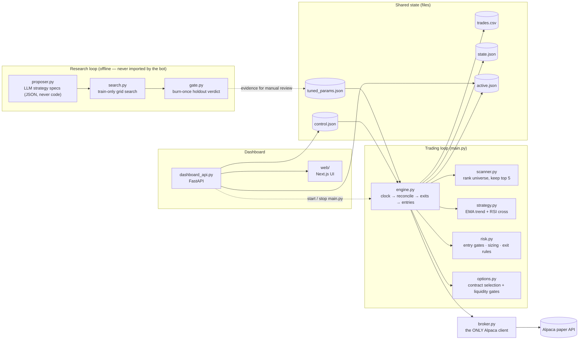

# A Research Harness That Makes It Hard to Fool Yourself

[](https://github.com/Manideep728/trading_bot_new/actions/workflows/ci.yml)

Backtesting lies. Search 700 strategy variants and the best one always looks
profitable — not because it works, but because you searched 700 times. This
repo is an attempt to build the machinery that stops that from happening, with
a live options bot on an **Alpaca paper account** as the thing being tested.

Where it currently stands, stated exactly:

> **986 candidate configurations have been searched and logged.** The three
> hand-written strategy families produced **zero** that cleared the bar. The
> first candidate to survive came from the LLM proposer — it reads the failure
> report, and hypothesized "trade calls only, only in uptrends, only when
> volatility is calm." That one cleared the search stage at +35.4% validation
> expectancy over 32 trades, against the live strategy's +5.2%.
>
> **It has not passed anything yet.** It is queued for the burn-once holdout
> gate, which has never been run. Nothing is deployed. A +35% number selected
> out of 986 tries is exactly the kind of result this repo exists to distrust —
> which is why the gate scores it as a *deflated* Sharpe against N=986, and
> why the holdout is consumed on the single attempt.

Every one of those 986 trials is committed to this repo, because that count is
the denominator of every claim the pipeline makes about itself.

**What enforces the honesty** (details in [Research loop](#research-loop-research)):

| Guard | The failure it prevents |
|---|---|
| **Committed trial registry** | A local-only log resets `N` to 0 on a fresh clone, and every result silently looks better than it is. |
| **Deflated Sharpe ratio** | Scores a result against *the best of N tries*, so a lucky winner out of 759 stops reading as skill. |
| **Burn-once holdout** | The out-of-sample window is consumed after a single gate attempt — pass or fail — so it can't be retried until it flatters. |
| **Select on train, touch validation once** | Ranking candidates by validation score and then reporting that score is selection bias. |
| **Quarantined + embargoed holdout** | Cut at the same calendar moment across both datasets, so no daily-bar check can peek at the gate's window. |
| **LLM proposes specs, never code** | The proposer picks from a fixed block vocabulary with clamped params and a capped grid — it cannot smuggle in arbitrary logic. |
| **No auto-deploy, ever** | A gate pass prints evidence for human review. Risk caps are in no search space. |

**Paper trading only.** The broker client is hard-wired to Alpaca's paper
endpoint. Nothing here is financial advice, and the live strategy has **no
demonstrated edge** — the risk caps exist to contain the damage while evidence
accumulates.


## The execution target: an options bot

The thing the harness evaluates is a real, running bot. It watches a 30-name
universe with a **two-tier scan**: every 30 minutes it ranks the whole universe
for "likely to produce a tradeable signal soon" and keeps the top 5; every 30
seconds it polls just those 5, computes EMA/RSI, and — when the strict rules
line up — buys a single call or put with a marketable limit order, then manages
the exit. Long options only: maximum possible loss on any trade is the premium
paid.

## Architecture



## Strategy (defaults in `bot/config.py`, tunables in `tuned_params.json`)

**Universe & two-tier scan** — the watchlist is 30 names: ~10 liquid index/
sector ETFs plus ~20 mega-caps (for movement and to decorrelate the
shortlist). Scanning them all every 30 s would be slow, so:

- **Rank tier (every 30 min):** score all 30 on `score = trend_clarity ×
  rsi_proximity × recent_volatility` (`bot/scanner.py`) — "primed to fire"
  weighted by "actually moving." Keep the top 5 as the active shortlist.
- **Poll tier (every 30 s):** evaluate only those 5 for entries.
- **Trade cooldown:** once a signal fires on a `(symbol, action)` it is
  suppressed for `signal_cooldown_sec` (30 min), so a fast poll can't
  re-trigger the same setup every cycle.
- **Earnings blackout:** single names within `earnings_blackout_days` (±3) of
  earnings are dropped from the shortlist — an overnight earnings gap can open
  straight through the stop. Dates come from a hand-maintained `earnings.json`
  (see `earnings.example.json`); ETFs and unlisted symbols are never blacked
  out.

**Entry** — evaluated per shortlisted symbol on the latest closed 15-minute
bar:

| Condition | Buy CALL | Buy PUT |
|---|---|---|
| Trend filter | EMA-fast > EMA-slow | EMA-fast < EMA-slow |
| Trigger | RSI(14) crosses **up** through the bull level | RSI(14) crosses **down** through the bear level |

The default RSI levels are 45/55, not the textbook 30/70 — measured on a year
of real SPY/QQQ 15-minute data, RSI almost never reaches classic extremes
while the trend filter agrees; 35/65 produced literally zero signals.

Contract picked: nearest expiry within **7–14 DTE**, first strike OTM, and it
must pass liquidity gates (bid > 0, spread ≤ 10% of mid, open interest ≥ 100).
Entries use a **marketable limit** (mid + 1%, capped at the ask); exits sell
with a limit at the bid. Unfilled orders are canceled after 120 s.

**Exits** (checked every loop, priced on the **bid**, not the mark): take
profit **+50%**, stop loss **−25%**, time stop at **≤ 2 DTE**, max hold
**2 days** (entry time from the trade journal).

**Risk gates** (hard — the self-tuner cannot touch these): max 3 open
positions, 1 per underlying, premium ≤ 2% of equity, max 3 new trades/day,
and a **daily circuit breaker** that halts new entries if the account is down
4% from yesterday's close. No entries in the first/last 15 minutes.

## Setup

```powershell
python -m venv .venv
.venv\Scripts\pip install -r requirements-dev.txt   # runtime + test/lint tooling
copy .env.example .env   # then edit .env
```

(`requirements.txt` alone is enough to *run* the bot; `requirements-dev.txt`
adds pytest, ruff, and mypy. Both are pinned so a clone reproduces CI.)

Get free **paper** API keys: sign up at https://alpaca.markets, open the
dashboard, switch to **Paper Trading**, and generate an API key pair. Put both
values in `.env`.

## Run

```powershell
.venv\Scripts\python main.py
```

- `DRY_RUN=true` (default): full pipeline with real market data; orders are
  **logged, not submitted**. Start here.
- `DRY_RUN=false`: orders are submitted to your **paper** account.

Every cycle logs the shortlist's indicator readings and the decision reason
(enter / skip / hold / exit) to the console and `bot.log`, and each re-rank
logs the new top-5 with their scores. Daily trade counts
survive restarts via `state.json`; every fill is journaled to `trades.csv`
with FIFO-matched realized P&L.

## Dashboard

The repository now includes a local web dashboard in `web/` and a small
FastAPI backend in `dashboard_api.py`.

```powershell
cd web
npm run dev
```

`npm run dev` boots the FastAPI backend automatically (reusing it if it's
already running on `:8000`) alongside the Next.js frontend, so opening the
dashboard never needs a second terminal. **Opening the dashboard does not
start the trading loop** — `main.py` only runs once you explicitly start it.

Equivalently, `.venv\Scripts\python run_dashboard.py` still launches the API
and frontend together from the Python side, without npm.

The dashboard reads live bot state from the API and shows the current signal
and risk reasoning for the **active shortlist** (the top-ranked names the
engine is actually polling, read from `active.json` — so a refresh costs a
handful of data calls, not one per universe symbol), plus two separate sets of
controls:

- **Bot process** — Start/stop the trading loop (`main.py`) itself as an OS
  process. This is the on/off switch; nothing trades while it's stopped.
- **Entry gate** — Pause/resume new entries on an already-running bot without
  touching exits, plus canceling orders and closing positions.

## Backtesting & self-tuning

```powershell
.venv\Scripts\python backtest.py --days 365          # replay current params
.venv\Scripts\python backtest.py --days 365 --tune   # guarded self-tuning
```

The backtester replays the exact live signal rules over historical bars with
an explicit option-P&L approximation (delta gearing, theta decay, spread
costs — constants in `bot/simulator.py`). `--tune` grid-searches the signal
and exit parameters under **hard guidelines** (`bot/tuner.py`):

1. Risk caps are not in the search space at all.
2. Every candidate value is clamped into `TUNABLE_BOUNDS` — twice.
3. ≥ 30 trades required on both the train and validation windows.
4. The winner is selected on **training** expectancy, then checked exactly
   once against validation: it must have positive validation expectancy AND
   beat the current parameters' validation expectancy by ≥ 10%. (Ranking
   candidates by validation score — and then reporting that same score as
   the evidence — is selection bias: across ~200 grid candidates the best
   validation score would be partly luck. Selecting on train and touching
   validation only once for the winner keeps it an honest out-of-sample
   check.)

Accepted changes are written to `tuned_params.json` **with their evidence**;
the bot applies them (re-clamped) on next start. If nothing qualifies, the
current parameters stand.

**Honest numbers** (365 days ending 2026-07-07, all costs modeled): default
params full-period expectancy was **−2.9%** of premium per trade across 117
trades — i.e. no demonstrated edge. The `tuned_params.json` checked into this
repo has evidence (+15.65% validation expectancy, 46 trades) generated by an
earlier version of the tuner that selected its winner on the validation
window itself — selection bias inflates that number, so treat it as stale.
Re-run `backtest.py --tune` to regenerate evidence under the corrected
train-then-validate selection above.

## Research loop (`research/`)

A guarded self-improvement pipeline, separate from the live bot (the engine
never imports it). The cycle:

```powershell
.venv\Scripts\python -m research fetch            # cache bars once; splits off a quarantined holdout
.venv\Scripts\python -m research search --family baseline   # select on TRAIN, judge on validation
.venv\Scripts\python -m research report           # failure analysis of train trades (you read this)
.venv\Scripts\python -m research robustness       # simulator-perturbation + daily regime checks
.venv\Scripts\python -m research gate             # burn-once out-of-sample verdict
```

Families: `baseline` (live EMA+RSI), `ema_slope`, `donchian`, `rsi_only`
(control). Honesty machinery: every candidate ever scored is logged to an
append-only `research/trials.jsonl` — **committed to git**, because that trial
count is the denominator of every honest claim the loop makes (a local-only
registry would reset N to 0 on a fresh clone and make every result look better
than it is, and the burn-once gate would stop being enforceable across
machines). The acceptance score is a **deflated Sharpe** (your Sharpe vs. the
best of N logged tries); the holdout window is **burned** after one gate
attempt — pass or fail — and a repeat is refused until new data accrues. A
gate pass prints evidence for *manual* review; nothing auto-deploys, and risk
caps are not in any search space. The `search` step also **skips candidates
already recorded on the same data window**, so re-running a family neither
repeats work nor inflates N with duplicates.

The data cache under `research/data/` is *not* committed (large, and
re-fetchable from Alpaca); a fresh clone runs `fetch` once before searching.

**A worked example** (30-name universe, 365d of 15-min bars). Searching the
hand-written families produced **759 logged trials and zero accepted winners**:
the selective RSI configs that survived the train filter fired too few times to
clear the ≥30-trade validation floor (`baseline` +33.8% but only 20 trades;
`ema_slope` +36.0% on 17), while the two families that traded often enough were
negative after costs (`donchian` −1.2% over 3,143 trades; `rsi_only`, the
deliberate control, −2.2% over 2,230). Note the shape of that failure — the
configs that *looked* best were the ones with almost no evidence behind them.
That is precisely what the trade floor exists to catch, and the registry
preserves those results so the same configs are never re-tested.

Phase 2 changed the outcome. Given the failure report, the LLM proposer
observed that uptrend entries averaged +35.1% against +4.0% in downtrends, and
calm-volatility entries +52.5% against −2.2% in high volatility — then composed
those two observations into `calm-uptrend-calls` (`calls_only` +
`max_entry_vol`, spec in `research/proposals/`). Its winner is the first
candidate to clear the search stage: **32 validation trades at +35.4%
expectancy**, versus +5.2% for the live strategy on the same window. The
registry now holds 986 unique trials.

That candidate's status is *pending*, not *proven*. It still has to survive the
burn-once holdout gate, where its Sharpe is deflated against N=986 — and one
attempt is all it gets.

**Phase 2 — the LLM proposer.** `python -m research propose` sends the
failure report + trial history to Claude, which proposes the next family as
a JSON **spec** — a combination of fixed building blocks (`research/blocks.py`:
trend x trigger x entry filters such as `max_entry_vol`, `entry_hours`,
`calls_only`), never code. Specs are validated, clamped into bounds, capped
in grid size, and searched via `search --spec research/proposals/<name>.json`
through the identical pipeline with full registry logging. Requires
`ANTHROPIC_API_KEY` in `.env`; without one, `propose --offline` writes the
exact prompt to `research/proposal_prompt.txt` for any LLM (or you) to answer.
The gate stays human-invoked and burn-once regardless of who proposed.

## Tests & quality gates

```powershell
.venv\Scripts\python -m pytest tests -q   # 205 tests
.venv\Scripts\python -m ruff check .      # lint
.venv\Scripts\python -m mypy              # type check
cd web; npm run lint; npm run build       # frontend
```

CI runs all five on every push and pull request.

205 tests cover the indicator math (including a known Wilder RSI value),
signal triggers, contract filters, every risk gate, journal P&L matching
(incl. partial-fill FIFO), the simulator (verified bar-for-bar identical to
the live signal logic), the tuner guardrails (clamping, non-tunable risk
caps, thin-evidence rejection, train-then-validate selection), the scanner
scoring/ranking, the earnings blackout, the active-shortlist persistence, the
dashboard snapshot (shortlist-only polling), full engine cycles against a fake
broker (entries, exits, order reconciliation, stale-order cancels, max-hold
via journal, two-tier ranking, cooldown, blackout), the engine PID lock, the
atomic file writer, the research loop (holdout splits/embargo, deflated
Sharpe, burn-once gate, select-on-train search, and registry-aware skip of
already-scored candidates), and the dashboard API — whose CSRF guard and
single-engine PID check are each verified to fail the suite when removed.

## Layout

```
main.py            entry point (logging, config validation, loop start)
backtest.py        backtest / self-tune CLI
bot/config.py      every tunable + TUNABLE_BOUNDS + clamped tuned-param loading
bot/indicators.py  EMA / Wilder RSI (pure math)
bot/scanner.py     universe ranking: hybrid vol-weighted "primed" score (pure)
bot/strategy.py    signal logic (pure)
bot/earnings.py    earnings blackout gate + earnings.json loader
bot/options.py     contract selection + liquidity gates (pure)
bot/risk.py        entry gates, sizing, exit rules incl. max hold (pure)
bot/simulator.py   backtest engine + option P&L model (pure)
bot/tuner.py       guarded grid search + walk-forward validation
bot/journal.py     trades.csv fill journal, FIFO realized P&L
bot/state.py       daily counters persisted to state.json
bot/watchlist.py   active shortlist persisted to active.json (engine -> dashboard)
bot/control.py     pause/resume flag shared with the dashboard
bot/dashboard.py   live snapshot builder for the dashboard API
bot/broker.py      the ONLY module that talks to Alpaca; DRY_RUN lives here
bot/engine.py      the loop: clock -> reconcile -> exits -> re-rank (due) -> poll shortlist -> sleep
dashboard_api.py   FastAPI backend for the web dashboard; also starts/stops main.py on request
run_dashboard.py   launches API + web frontend together (Python-side alternative to npm run dev)

research/data.py       bar cache + train/val/holdout splits with calendar embargo
research/families.py   built-in strategy families (baseline, ema_slope, donchian, rsi_only)
research/blocks.py     the fixed block vocabulary an LLM proposal may combine
research/search.py     select-on-train grid search, registry-aware
research/registry.py   append-only trial log (committed: it is the honest denominator)
research/metrics.py    deflated Sharpe
research/gate.py       burn-once out-of-sample verdict
research/proposer.py   Claude proposes a spec (JSON, never code)

web/src/app/page.tsx              composition only
web/src/hooks/use-dashboard.ts    polling, actions, and all dashboard state
web/src/components/dashboard/     one file per panel + shared primitives
web/scripts/dev-with-api.js       npm run dev entrypoint: boots the API, then next dev
```

## License

MIT — see [LICENSE](LICENSE).
