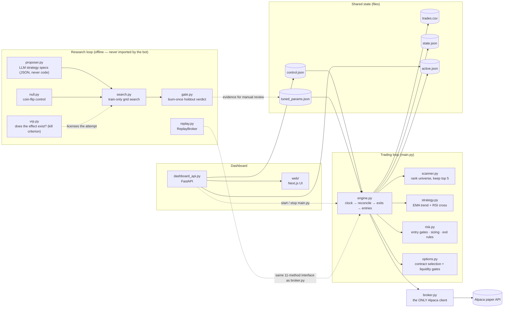

# The Backtester Was Lying, and I Built the Test That Caught It

[](https://github.com/Manideep728/trading_bot_new/actions/workflows/ci.yml)

An options trading bot on an **Alpaca paper account**, plus the research harness
that evaluates it. The interesting part is not the bot. It's that the harness
searched 986 strategy configurations, reported plausible numbers for all of
them, and every one of those numbers was wrong — because of four lines in the
simulator's exit loop.

This README leads with that bug, because finding it is the work. The second half
is what came after: a pre-registered test of a documented market effect, which
the harness also rejected — for a reason worth reading.

## The bug

`bot/simulator.py` has no option prices. It approximates:

```
option_return = underlying_move × gearing − theta × days − roundtrip_cost
```

with `gearing = delta / premium_pct_of_spot = 0.40 / 0.005 = **80×**`.

At 80×, the exits trigger on almost no movement: `take_profit_pct = 0.50` needs
a **+0.625%** move in the underlying, and `stop_loss_pct = 0.25` needs **−0.31%**.
A normal daily bar moves ±2%, i.e. 3–6× past *both* barriers at once. The exit
loop detected the crossing and then recorded **the bar's full return**, not the
barrier — and that return was floored at −100% on the loss side (correct for an
option premium) while the gain side was unbounded:

| next daily bar | raw model return | what the code booked |
|---|---|---|
| stock **+2%** | +152% | **+152%** — though it claimed to exit at +50% |
| stock **−2%** | −168% | **−100%** — though it claimed to exit at −25% |

Same size move, opposite sign. The win books +152%, the loss books −100%.
Symmetric price noise, asymmetric P&L: **volatility alone produced expectancy,
with no forecast involved.** The repo's own `research/report.txt` had been
showing the symptom all along — stop-losses averaging **−44.4%** against a −30%
stop, take-profits **+51.8%** against a +40% target — and nobody read it as a
bug.

Isolated by varying that one function, same coin-flip signal, same bars:

| how barrier exits are booked | daily bars | 15-min bars |
|---|---|---|
| **as the code did it** (overshoot, floored at −100%) | **+11.1%** | −3.1% |
| book the barrier level it claimed to exit at | +5.1% | −0.3% |
| overshoot with no −100% floor (symmetric) | −19.8% | −5.2% |

The floor alone was worth **31 percentage points** of phantom edge.

## The test that catches it

A random signal should earn about zero, minus costs. Nothing in this repo had
ever checked. `research/null.py` checks, and it is wired in as a *threshold*,
not a report:

```powershell
.venv\Scripts\python -m research null --window daily --trades 1200
```
```
null: 60 seeds, mean trades=1163
  mean expectancy      +14.74%
  p95 threshold        +25.70%

WARNING: a coin flip EARNS +14.74% per trade here. A signal-free strategy should
pay the spread, not collect it, so the P&L model is not valid on these bars —
treat every number computed on them as unusable, not merely optimistic.
```

That +14.74% was enough to pass `robustness.daily_regime_check`, whose only
criterion was `expectancy > 0`. **The repo's sole multi-regime guard could not
fail a zero-skill signal.** It now requires a fold to beat its own null's 95th
percentile; `donchian` passed all six folds under the old rule and fails all six
under this one.

The random signal is deliberately built as a real `Family` and run through
`search.run_family` — the identical code path a genuine candidate takes. A null
with its own private simulator would drift away from the thing it is supposed to
be measuring, which is the exact class of bug it exists to catch.

## Four more defects the same audit turned up

**Un-tradeable bars.** 10,485 of 166,473 cached bars (**6.30%**) fell outside
09:30–16:00 ET. US listed options don't trade then, so an "exit" priced off an
08:00 ET print is a fill that could never have happened. Filtering now happens
at fetch time *and* on read, so the existing cache is corrected rather than
waiting for someone to remember to refetch.

**Unadjusted prices.** `adjustment` was never set on the Alpaca request, so the
daily cache contained a −95.1% single "day" in GOOGL (its 20:1 split), −94.9%
in AMZN, −90.1% in NFLX, −89.9% in NVDA. At 80× gearing a put "earns" +7,600%
on that, inside the multi-year regime check.

**Splits cut per symbol, not per calendar.** Each symbol was cut at a fraction
of *its own* bar count. Bar counts range 5,043 (COST) to 6,738 (QQQ), so the
train/validation boundary landed on **9 different dates** spanning 2026-02-19 to
2026-03-05. On a universe of near-100%-beta names that is a leak: the same
market move sat in one symbol's training window and another's validation window,
and `EMBARGO_BARS` couldn't help because it only ever guarded *within* a symbol.
Now one cutoff is computed as a quantile of the pooled timeline — 9 dates
collapse to 1, and the latest training bar anywhere precedes the earliest
validation bar anywhere. The embargo stays counted in *bars*, because its job is
stopping an indicator lookback straddling the cut.

**A guard that could never pass.** `max_entry_vol` is documented as per-bar
return stdev *on 15-minute bars*; `daily_regime_check` ran that same number
against daily bars, where stdev is ~√26 larger. The pending spec matched **zero**
daily bars in all six year folds, so the check reported FAIL for a unit mismatch
rather than an economic reason — and no spec using a volatility filter could
ever have passed it. Bar-relative params are now rescaled by √(bars per day);
bar *counts* are left alone. `entry_hours`, which has no daily equivalent at
all, now reports NOT EVALUABLE, which is distinct from failing.

Both of those I had first written off as "real, but not what caused the false
edge." They were still wrong, so they're fixed.

## What it did to the headline result

The previous version of this README led with a candidate at "+35.4% validation
expectancy over 32 trades, against the live strategy's +5.2%." Re-measured after
all of the above:

| window | candidate | its own coin-flip null | verdict |
|---|---|---|---|
| **train** (what it was selected on) | −3.28% over 148 trades | mean −1.36%, p95 +12.27% | **46.7th percentile — a coin flip does better** |
| **validation** | +39.91% over 24 trades | mean −0.18%, p95 +18.40% | beats the null, but 24 < the 30-trade floor |

It cannot beat a coin flip on the data it was selected on. Clustering its trades
by entry bar drops its Sharpe from +0.4166 to +0.2641 and its deflated Sharpe
from 0.6471 to 0.3226 against a 0.95 bar — it was already failing, and now it
fails by the margin the evidence actually supports.

**The observation it was built on inverted.** The LLM proposal's stated
hypothesis was *"low-vol entries +52.5% vs −2.2% in high vol — trade only when
entry volatility is calm."* Re-running the same failure report over corrected
bars:

| entry volatility | before | after |
|---|---|---|
| low | **+52.5%** | **−13.3%** (n=50, 74% losers) |
| high | −2.2% | +3.9% (n=49) |

The calm-volatility edge was the artifact. Low-vol entries are now the *worst*
bucket, which is what you would expect once volatility stops being a source of
free expectancy: the bug paid out in proportion to how far a bar overshot its
barrier, so the strategy that looked best was the one selecting for the bars
where that mattered most. A spec built to exploit that observation was always
going to be a spec built to exploit the bug.

It would no longer be accepted by `search`, and the burn-once holdout gate has
still never been run — which is the correct outcome, not a disappointment. Every
one of the 986 logged trials remains committed and counted in `N`, because those
attempts genuinely happened; they are marked non-comparable by a
`dataset_change` row rather than deleted.

**Paper trading only.** The broker client is hard-wired to Alpaca's paper
endpoint. Nothing here is financial advice, and the live strategy has **no
demonstrated edge** — four completed round trips on the paper account, all four
losers, −$600 realized. The risk caps exist to contain the damage while evidence
accumulates.

## The second attempt: sell the variance risk premium

The audit above corrected the measurement. It did not supply a strategy. So the
next question was whether the signal had any forecast power at all, independent
of the P&L model. Measure the direction-adjusted move of the UNDERLYING after
every signal, and no option pricing is involved:

| horizon after the signal | baseline | donchian | rsi_only |
|---|---:|---:|---:|
| 15 minutes | +0.003% | −0.005% | −0.004% |
| 1 hour | −0.020% | −0.017% | −0.007% |
| 1 day | −0.136% | −0.091% | −0.046% |
| 32 hours | −0.724% | −0.448% | −0.282% |

Zero or negative at every horizon, on 154,000 bars. Decomposing the P&L per
trade agrees: the directional term is **−0.02%**, theta is −1.77%, and the round
trip is −3.00%. No exit rule, leverage level, or holding period repairs a signal
that forecasts nothing. Tuning was therefore the wrong response.

The bot buys options. It is on the losing side of the best documented effect in
its own market: **implied volatility usually exceeds the volatility that then
occurs, and option sellers collect the difference.** The remaining work tests
that effect, with a kill criterion registered before any result existed.

### Step 1 — does the premium exist here?

No bot code was written for this step, because the previous failure was building
machinery before measuring the effect. `research/vrp.py` needs two public series
and prices nothing.

```powershell
.venv\Scripts\python -m research vrp
```
```
VIX/SPY: 2645 overlapping days (2016-01-04 .. 2026-07-13), 126 independent cycles
  mean implied          18.53
  mean VRP              +3.79   median +4.71   positive on 84.3% of days
  cost hurdle            0.56   (round trip 3% of premium)
  worst single day     -63.39   (2020-02-20: implied 15.6 vs realized 79.0)
  max drawdown          64.33   (cumulative vol points, independent cycles)
  -> CLEARS the cost hurdle
```

The premium is 6.8 times the cost of collecting it, and it survives the 6% round
trip that the live liquidity gate tolerates. It is also collected in calm
markets and lost in one event: the worst single observation is 17 times the
mean, and it starts from an implied volatility of 15.6, which is the calm third
of the sample. The tail is the whole risk.

Note the two measurements that are separate on purpose. Drawdown uses
**non-overlapping** cycles, because consecutive daily rows share 20 of their 21
forward days — one crash smeared across 21 rows flatters every drawdown, and a
short-volatility strategy is judged on exactly that.

### Step 2 — three defects that made the ruler unusable for this

A coin flip must lose money. On short premium it must instead **earn the
premium**, so the null changes meaning: a positive null is the effect, and the
candidate has to beat it. That only works if the pricing is real.

**Linear pricing.** The simulator approximated the option return from a fixed
delta and a fixed premium. `bot/pricing.py` now prices with Black-Scholes from
(spot, strike, time, volatility, rate). The real premium is 0.93% of spot, not
the 0.5% assumed, so the true gearing is **43×, not 80×**.

**Closes only.** `research/data.py` stored `close` and discarded open, high, and
low. A barrier exit was therefore inferred from a close, which is what produced
the overshoot. Bars now carry every column, and the adverse extreme is tested
first when one bar touches both barriers.

**No implied volatility.** Every option was priced at a flat 20%. VIX, VXN, and
RVX supply a real daily series for SPY, QQQ, and IWM.

Each input alone left the coin flip profitable. Both were required:

| window | closes only | full bars + real IV |
|---|---:|---:|
| SPY/QQQ/IWM daily | −9.83% | **−12.61%** |
| 30 symbols, daily | **+12.55%** | **−5.96%** |
| 30 symbols, intraday | **+1.86%** | **−1.99%** |

**Short positions also needed a denominator.** A seller's maximum loss is not
the premium. The model therefore trades **defined-risk credit spreads** only —
short one strike, long a further one — so the loss is bounded and known, and
every return is a fraction of capital at risk. Naked short options cannot be
represented. `research/robustness.py` gained a tail check on worst trade and
maximum drawdown, because expectancy cannot judge a short-volatility book.

### Step 3 — the verdict

Three entry rules were tested against the same control, on the same bars.

| rule | validation expectancy | percentile of its own null | verdict |
|---|---:|---:|---|
| sell on every bar (passive) | +1.54% | 81.0 | **REJECTED** |
| sell when IV rank is high | −1.01% | 7.0 | **REJECTED** |
| sell when IV exceeds trailing realized vol | +1.19% | 69.5 | **REJECTED** |

**The control is positive, and that is the finding.** A coin flip that sells
premium with random timing earns **+0.70% to +0.82% per trade**. The premium is
real, it survives costs, and passive collection captures it — but no timing rule
tested here is distinguishable from random timing. That is what theory predicts
for a risk premium rather than a mispricing: the seller is paid for holding a
risk, not for knowing something.

The first result of the three was **ACCEPTED** until the control was corrected.
The coin flip was still BUYING options, which loses 9.81% per trade, so any
seller cleared that bar without an edge. A control must trade the same structure
as the candidate; `null.null_family` now takes the action pair as an argument.
That change alone moved the passive family from ACCEPTED to REJECTED.

The IV-rank rule inverted, and the reason is instructive. It sells when implied
volatility is at the top of its own range, which is when realized volatility has
already overtaken it — it sells into a fall in progress. It was built on the
regime table above, where the stressed third pays +5.06 against the calm third's
+2.56. That table rests on one crash. It did not survive contact with a trading
rule.

The third rule was written to invert that error: compare implied against the
volatility the underlying is actually delivering, so the same crash that
maximizes IV rank makes this rule stand down. The search was free to demand a
rich premium and **selected the lowest threshold in the grid** (`vrp_min = 0.0`),
which is the setting closest to no filter at all. Every filter subtracted.

`research/candidate.json` held the wrongly-accepted passive candidate, stamped
with the old control's numbers. Running `gate` would have spent the burn-once
holdout on a candidate that is in fact rejected. The file was deleted, and the
holdout is still sealed.

## One broker interface, two implementations

There was a second problem, structural rather than arithmetic: **the backtest
tested a different system than the one that trades.**

`simulate()` reads 8 of the ~40 fields in `Settings`. It knows the signal and
the exits. It has never known about `max_positions` (3), `max_trades_per_day`
(3), `max_positions_per_underlying`, `signal_cooldown_sec` (30 min),
`active_list_size` (only 5 of 30 names are ever polled),
`skip_open_minutes`/`skip_close_minutes`, the earnings blackout,
`min_open_interest`, or `max_spread_pct_of_mid`.

The fix needed no rewrite, because `bot/engine.py` was already built for it:

> Depends only on the broker interface (duck-typed), never on alpaca directly,
> so the whole cycle is testable with a fake broker.
> — `bot/engine.py`, line 3

`tests/test_engine.py` already proved that interface is **11 methods** wide.
So `research/replay.py` implements the same 11 methods against the CSV bar cache,
and `Engine.run_cycle()` — the real one, with the real `bot/risk.py`,
`bot/scanner.py` and `bot/options.py` running inside it — becomes the thing
under test. A one-hour spike confirmed this before the class was written:
driving `run_cycle` off cached bars required **zero edits to `bot/engine.py`**.

```powershell
.venv\Scripts\python -m research replay --window val --compare
```
```
                trades   expectancy
simulate()         251       +5.91%     <- no caps, no cooldown, no shortlist
real engine         30      +32.74%     <- every risk gate active
```

The engine takes **12%** of the simulator's trades. Those are not two estimates
of one system; they are two systems.

Two invariants that file has to hold, both pinned by tests:

- **Causality.** `get_closes(symbol)` returns bars up to and including `now` and
  never one further, truncated to `bar_history_count` exactly as the live broker
  does. A leak here would be invisible and would make every result meaningless.
- **One P&L model.** Open positions reprice through
  `bot.simulator.option_return` — the same function `simulate()` uses. This is a
  transitional state, stated plainly: `simulate()` stays for fast grid search and
  should be deleted once replay is fast enough to search with. Two pricing models
  is the drift this module exists to remove.

What replay still does **not** model: real option quotes (the chain is
synthesized from `SimParams`, so no IV, no smile, no term structure); the
limit-order lifecycle, since buys fill at the ask whereas the live engine posts a
marketable limit and cancels it unfilled after 120s — so adversely-selected
non-fills are absent; partial fills; assignment; multi-contract sizing.

### A live-engine bug replay found on its first real run

`manage_exits` skipped any position with `current_price <= 0`, logging *"no
price; skipping exit check"*. The name was the bug. `get_option_positions`
prices at the bid and falls back to Alpaca's mark, so zero means neither exists
— the contract is dead, not unpriced. Because the guard `continue`d before
`risk.exit_reason` ran, **no** exit rule applied: not the stop, not the time
stop, not max hold. The position sat there holding one of three `max_positions`
slots until expiry — up to two weeks of the account's capacity, for nothing.

Fixed by falling through instead of skipping. `pnl_pct` is then −100%,
`exit_reason` returns the stop loss, and `close_option` **already** market-closes
when handed a bid of zero — that path existed and was simply unreachable. I had
first called this a trading decision needing a market-order design; that was
wrong, and reading `broker.py` instead of assuming would have caught it sooner.


## The execution target: an options bot

The thing the harness evaluates is a real, running bot. It watches a 30-name
universe with a **two-tier scan**: every 30 minutes it ranks the whole universe
for "likely to produce a tradeable signal soon" and keeps the top 5; every 30
seconds it polls just those 5, computes EMA/RSI, and — when the strict rules
line up — buys a single call or put with a marketable limit order, then manages
the exit. Long options only: maximum possible loss on any trade is the premium
paid.

## Architecture



## Strategy (defaults in `bot/config.py`, tunables in `tuned_params.json`)

**Universe & two-tier scan** — the watchlist is 30 names: ~10 liquid index/
sector ETFs plus ~20 mega-caps (for movement and to decorrelate the
shortlist). Scanning them all every 30 s would be slow, so:

- **Rank tier (every 30 min):** score all 30 on `score = trend_clarity ×
  rsi_proximity × recent_volatility` (`bot/scanner.py`) — "primed to fire"
  weighted by "actually moving." Keep the top 5 as the active shortlist.
- **Poll tier (every 30 s):** evaluate only those 5 for entries.
- **Trade cooldown:** once a signal fires on a `(symbol, action)` it is
  suppressed for `signal_cooldown_sec` (30 min), so a fast poll can't
  re-trigger the same setup every cycle.
- **Earnings blackout:** single names within `earnings_blackout_days` (±3) of
  earnings are dropped from the shortlist — an overnight earnings gap can open
  straight through the stop. Dates come from a hand-maintained `earnings.json`
  (see `earnings.example.json`); ETFs and unlisted symbols are never blacked
  out.

**Entry** — evaluated per shortlisted symbol on the latest closed 15-minute
bar:

| Condition | Buy CALL | Buy PUT |
|---|---|---|
| Trend filter | EMA-fast > EMA-slow | EMA-fast < EMA-slow |
| Trigger | RSI(14) crosses **up** through the bull level | RSI(14) crosses **down** through the bear level |

The default RSI levels are 45/55, not the textbook 30/70 — measured on a year
of real SPY/QQQ 15-minute data, RSI almost never reaches classic extremes
while the trend filter agrees; 35/65 produced literally zero signals.

Contract picked: nearest expiry within **7–14 DTE**, first strike OTM, and it
must pass liquidity gates (bid > 0, spread ≤ 10% of mid, open interest ≥ 100).
Entries use a **marketable limit** (mid + 1%, capped at the ask); exits sell
with a limit at the bid. Unfilled orders are canceled after 120 s.

**Exits** (checked every loop, priced on the **bid**, not the mark): take
profit **+50%**, stop loss **−25%**, time stop at **≤ 2 DTE**, max hold
**2 days** (entry time from the trade journal).

**Risk gates** (hard — the self-tuner cannot touch these): max 3 open
positions, 1 per underlying, premium ≤ 2% of equity, max 3 new trades/day,
and a **daily circuit breaker** that halts new entries if the account is down
4% from yesterday's close. No entries in the first/last 15 minutes.

## Setup

```powershell
python -m venv .venv
.venv\Scripts\pip install -r requirements-dev.txt   # runtime + test/lint tooling
copy .env.example .env   # then edit .env
```

(`requirements.txt` alone is enough to *run* the bot; `requirements-dev.txt`
adds pytest, ruff, and mypy. Both are pinned so a clone reproduces CI.)

Get free **paper** API keys: sign up at https://alpaca.markets, open the
dashboard, switch to **Paper Trading**, and generate an API key pair. Put both
values in `.env`.

## Run

```powershell
.venv\Scripts\python main.py
```

- `DRY_RUN=true` (default): full pipeline with real market data; orders are
  **logged, not submitted**. Start here.
- `DRY_RUN=false`: orders are submitted to your **paper** account.

Every cycle logs the shortlist's indicator readings and the decision reason
(enter / skip / hold / exit) to the console and `bot.log`, and each re-rank
logs the new top-5 with their scores. Daily trade counts
survive restarts via `state.json`; every fill is journaled to `trades.csv`
with FIFO-matched realized P&L.

## Dashboard

The repository now includes a local web dashboard in `web/` and a small
FastAPI backend in `dashboard_api.py`.

```powershell
cd web
npm run dev
```

`npm run dev` boots the FastAPI backend automatically (reusing it if it's
already running on `:8000`) alongside the Next.js frontend, so opening the
dashboard never needs a second terminal. **Opening the dashboard does not
start the trading loop** — `main.py` only runs once you explicitly start it.

Equivalently, `.venv\Scripts\python run_dashboard.py` still launches the API
and frontend together from the Python side, without npm.

The dashboard reads live bot state from the API and shows the current signal
and risk reasoning for the **active shortlist** (the top-ranked names the
engine is actually polling, read from `active.json` — so a refresh costs a
handful of data calls, not one per universe symbol), plus two separate sets of
controls:

- **Bot process** — Start/stop the trading loop (`main.py`) itself as an OS
  process. This is the on/off switch; nothing trades while it's stopped.
- **Entry gate** — Pause/resume new entries on an already-running bot without
  touching exits, plus canceling orders and closing positions.

## Backtesting & self-tuning

```powershell
.venv\Scripts\python backtest.py --days 365          # replay current params
.venv\Scripts\python backtest.py --days 365 --tune   # guarded self-tuning
```

The backtester replays the exact live signal rules over historical bars with
an explicit option-P&L model — Black-Scholes in `bot/pricing.py`, driven by the
implied volatility, days to expiry, and round-trip cost in `SimParams`.
`--tune` grid-searches the signal
and exit parameters under **hard guidelines** (`bot/tuner.py`):

1. Risk caps are not in the search space at all.
2. Every candidate value is clamped into `TUNABLE_BOUNDS` — twice.
3. ≥ 30 trades required on both the train and validation windows.
4. The winner is selected on **training** expectancy, then checked exactly
   once against validation: it must have positive validation expectancy AND
   beat the current parameters' validation expectancy by ≥ 10%. (Ranking
   candidates by validation score — and then reporting that same score as
   the evidence — is selection bias: across ~200 grid candidates the best
   validation score would be partly luck. Selecting on train and touching
   validation only once for the winner keeps it an honest out-of-sample
   check.)

Accepted changes are written to `tuned_params.json` **with their evidence**;
the bot applies them (re-clamped) on next start. If nothing qualifies, the
current parameters stand.

Note that `--tune` uses a **single chronological train/validation split**, not
walk-forward analysis — there are no rolling windows and no re-fit sequence. This
README used to call it walk-forward, which was wrong.

**Honest numbers.** The `tuned_params.json` checked into this repo carries
evidence (+15.65% validation expectancy, 46 trades) that is stale twice over:
it was generated by an earlier tuner that selected its winner on the validation
window itself, *and* it predates the simulator fix above. The live bot still
loads it on start, which is the least defensible thing in the repo right now.
Re-run `backtest.py --tune` to regenerate under the corrected selection and the
corrected P&L model, and expect most previously "profitable" configurations to
invert — that is the fix working, not a regression.

## Research loop (`research/`)

A guarded self-improvement pipeline, separate from the live bot (the engine
never imports it). The cycle:

```powershell
.venv\Scripts\python -m research fetch            # cache bars once; splits off a quarantined holdout
.venv\Scripts\python -m research vrp              # does the effect exist? the pre-registered kill criterion
.venv\Scripts\python -m research search --family baseline   # select on TRAIN, judge on validation
.venv\Scripts\python -m research report           # failure analysis of train trades (you read this)
.venv\Scripts\python -m research null             # what a coin flip earns on the same bars
.venv\Scripts\python -m research replay --compare # the REAL engine over cached bars
.venv\Scripts\python -m research robustness       # perturbation + daily regime check vs the null
.venv\Scripts\python -m research gate             # burn-once out-of-sample verdict
```

**What enforces the honesty:**

| Guard | The failure it prevents |
|---|---|
| **Coin-flip null** | A guard that only asks `expectancy > 0` passes a random signal whenever the P&L model is broken. This is the one that caught everything above. |
| **Structure-matched control** | A control that BUYS options while the candidate SELLS them measures the cost of buying, not the skill of the candidate. This moved a short-premium family from ACCEPTED to REJECTED. |
| **Pre-registered kill criterion** | The threshold for "the effect exists" is written down before the measurement runs, so it cannot be adjusted to fit the result. |
| **Tail check** | Expectancy cannot judge a short-volatility book: it wins small and often and loses large and rarely, so a sound book and a doomed one look identical on the average. Worst trade and maximum drawdown are separate pass/fail criteria. |
| **Committed trial registry** | A local-only log resets `N` to 0 on a fresh clone, and every result silently looks better than it is. |
| **Dataset-keyed trial identity** | A score keyed on the string `"train"` survives `fetch` moving the split boundaries, so the searcher reuses a number computed on different bars. |
| **Deflated Sharpe ratio** | Scores a result against *the best of N tries*, so the luckiest of 986 stops reading as skill. |
| **Burn-once holdout** | The out-of-sample window is consumed after a single gate attempt — pass or fail — so it can't be retried until it flatters. |
| **Select on train, touch validation once** | Ranking candidates by validation score and then reporting that score is selection bias. |
| **Quarantined + embargoed holdout** | `load_bars()` raises on `kind="holdout"`; exactly one function can reach that directory. |
| **LLM proposes specs, never code** | The proposer picks from a fixed block vocabulary with clamped params and a capped grid — it cannot smuggle in arbitrary logic. |
| **No auto-deploy, ever** | A gate pass prints evidence for human review. Risk caps are in no search space. |

Families: `baseline` (live EMA+RSI), `ema_slope`, `donchian`, `rsi_only`
(control), and three short-premium families — `short_put_passive` (the
benchmark), `short_put_iv_rank`, and `short_put_vrp_spread`. Honesty machinery: every candidate ever scored is logged to an
append-only `research/trials.jsonl` — **committed to git**, because that trial
count is the denominator of every honest claim the loop makes (a local-only
registry would reset N to 0 on a fresh clone and make every result look better
than it is, and the burn-once gate would stop being enforceable across
machines). The acceptance score is a **deflated Sharpe** (your Sharpe vs. the
best of N logged tries); the holdout window is **burned** after one gate
attempt — pass or fail — and a repeat is refused until new data accrues. A
gate pass prints evidence for *manual* review; nothing auto-deploys, and risk
caps are not in any search space. The `search` step also **skips candidates
already recorded on the same data window**, so re-running a family neither
repeats work nor inflates N with duplicates.

The data cache under `research/data/` is *not* committed (large, and
re-fetchable from Alpaca); a fresh clone runs `fetch` once before searching.

**A worked example** (30-name universe, 365d of 15-min bars). Searching the
hand-written families produced **~841 logged trials and zero accepted winners**:
the selective RSI configs that survived the train filter fired too few times to
clear the ≥30-trade validation floor, while the two families that traded often
enough were negative after costs (`donchian` over 3,143 trades; `rsi_only`, the
deliberate control, over 2,230). Note the shape of that failure — the configs
that *looked* best were the ones with almost no evidence behind them. That is
precisely what the trade floor exists to catch.

Phase 2 appeared to change the outcome. Given the failure report, the LLM
proposer observed that uptrend entries scored far better than downtrend ones and
calm-volatility entries far better than high-volatility ones, then composed those
into `calm-uptrend-calls` (`calls_only` + `max_entry_vol`, spec in
`research/proposals/`). Its winner was the first candidate ever to clear the
search stage, at 986 unique trials.

**It did not survive the audit.** See [What it did to the headline
result](#what-it-did-to-the-headline-result): re-measured with the exit
accounting fixed and un-tradeable bars removed, it sits at the 38.3rd percentile
of its own coin-flip null on the window it was selected on. The specific numbers
that were quoted here — 32 validation trades at +35.4% against the live
strategy's +5.2% — were produced by the broken model and are not reproducible.
The registry still counts all 986 attempts, marked non-comparable rather than
deleted, because that count is the honest denominator for anything claimed about
the old data.

The burn-once holdout gate has never been run, and should not be run on this
candidate. Burning the one-shot out-of-sample window on a result the null already
rejects would spend the only irreversible resource in the repo on a foregone
conclusion.

**Phase 2 — the LLM proposer.** `python -m research propose` sends the
failure report + trial history to Claude, which proposes the next family as
a JSON **spec** — a combination of fixed building blocks (`research/blocks.py`:
trend x trigger x entry filters such as `max_entry_vol`, `entry_hours`,
`calls_only`), never code. Specs are validated, clamped into bounds, capped
in grid size, and searched via `search --spec research/proposals/<name>.json`
through the identical pipeline with full registry logging. Requires
`ANTHROPIC_API_KEY` in `.env`; without one, `propose --offline` writes the
exact prompt to `research/proposal_prompt.txt` for any LLM (or you) to answer.
The gate stays human-invoked and burn-once regardless of who proposed.

## Tests & quality gates

```powershell
.venv\Scripts\python -m pytest tests -q   # 374 tests
.venv\Scripts\python -m ruff check .      # lint
.venv\Scripts\python -m mypy              # type check
cd web; npm run lint; npm run build       # frontend
```

CI runs all five on every push and pull request.

The tests worth reading first are the ones that pin the findings above:

- `test_intra_session_barrier_ignores_overshoot_size` — two very different
  overshoots past the same stop must book the same loss. The old code booked
  −0.51 and −1.00 where it now books −0.25 twice.
- `test_regime_guard_rejects_a_coin_flip` — a zero-skill signal must not pass the
  multi-regime check. This is the regression test for the whole audit.
- `test_tail_check_fails_a_book_that_looks_fine_on_average` — 200 wins at +5% and
  one −900% loss. Expectancy says the book is profitable; the tail check fails it.
- `test_vrp_spread_stands_down_in_the_crash_that_iv_rank_leans_into` — the two
  short-premium entry rules must disagree on the case that separates them.
- `test_max_loss_is_a_true_bound_at_every_cost_level` — parametrized over four
  cost levels and both structures. A spread that loses more than its stated
  bound is not defined-risk, and the first version lost 102% of it.
- `test_get_closes_never_returns_a_bar_at_or_after_now` — the replay causality
  contract, checked at every step rather than once.
- `test_positions_reprice_through_the_shared_option_model` — replay must not grow
  a second P&L model.
- `test_daily_bars_are_never_session_filtered` — the session filter would delete
  the entire daily cache if it were applied to 00:00 ET daily timestamps.
- `test_in_session_follows_dst_not_a_fixed_utc_offset` — 13:30 UTC is 09:30 EDT
  in July and 08:30 EST in January; a hard-coded window is wrong half the year.
- `test_same_params_on_a_different_dataset_is_a_different_trial` — the stale
  score-reuse bug.
- `test_mutating_route_rejected_without_csrf_header` — parametrized across every
  mutating dashboard route, and verified to fail the suite when the guard is
  removed.

The rest cover indicator math (including a known Wilder RSI value), signal
triggers, contract filters, every risk gate, journal P&L matching (incl.
partial-fill FIFO), the simulator's equivalence with the live signal at every
bar prefix, tuner guardrails (clamping, non-tunable risk caps, thin-evidence
rejection, train-then-validate selection), scanner ranking, the earnings
blackout, shortlist persistence, the dashboard snapshot, full engine cycles
against a fake broker (entries, exits, order reconciliation, stale-order
cancels, max-hold via journal, two-tier ranking, cooldown, blackout), the
engine PID lock, the atomic file writer, and the research loop (holdout
splits/embargo, deflated Sharpe, burn-once gate, select-on-train search,
registry-aware skip).

## Layout

```
main.py            entry point (logging, config validation, loop start)
backtest.py        backtest / self-tune CLI
bot/config.py      every tunable + TUNABLE_BOUNDS + clamped tuned-param loading
bot/indicators.py  EMA / Wilder RSI (pure math)
bot/scanner.py     universe ranking: hybrid vol-weighted "primed" score (pure)
bot/strategy.py    signal logic (pure)
bot/earnings.py    earnings blackout gate + earnings.json loader
bot/options.py     contract selection + liquidity gates (pure)
bot/risk.py        entry gates, sizing, exit rules incl. max hold (pure)
bot/simulator.py   fast backtest engine + THE option P&L model (pure)
bot/pricing.py     Black-Scholes price, delta, vega, and credit-spread value (pure)
bot/tuner.py       guarded grid search + one chronological train/val split
bot/journal.py     trades.csv fill journal, FIFO realized P&L
bot/state.py       daily counters persisted to state.json
bot/watchlist.py   active shortlist persisted to active.json (engine -> dashboard)
bot/control.py     pause/resume flag shared with the dashboard
bot/dashboard.py   live snapshot builder for the dashboard API
bot/broker.py      the ONLY module that talks to Alpaca; DRY_RUN lives here
bot/engine.py      the loop: clock -> reconcile -> exits -> re-rank (due) -> poll shortlist -> sleep
dashboard_api.py   FastAPI backend for the web dashboard; also starts/stops main.py on request
run_dashboard.py   launches API + web frontend together (Python-side alternative to npm run dev)

research/data.py       bar cache, session filter, train/val/holdout splits + embargo
research/vrp.py        the variance risk premium: implied vs subsequent realized vol
research/families.py   built-in strategy families (directional + short premium)
research/blocks.py     the fixed block vocabulary an LLM proposal may combine
research/search.py     select-on-train grid search, registry-aware, null-gated
research/null.py       the coin-flip control every candidate is measured against
research/replay.py     ReplayBroker: the real engine driven over cached bars
research/registry.py   append-only trial log (committed: it is the honest denominator)
research/metrics.py    deflated Sharpe
research/robustness.py SimParams perturbation + daily regime check vs the null
research/gate.py       burn-once out-of-sample verdict
research/proposer.py   Claude proposes a spec (JSON, never code)

web/src/app/page.tsx              composition only
web/src/hooks/use-dashboard.ts    polling, actions, and all dashboard state
web/src/components/dashboard/     one file per panel + shared primitives
web/scripts/dev-with-api.js       npm run dev entrypoint: boots the API, then next dev
```

## License

MIT — see [LICENSE](LICENSE).
