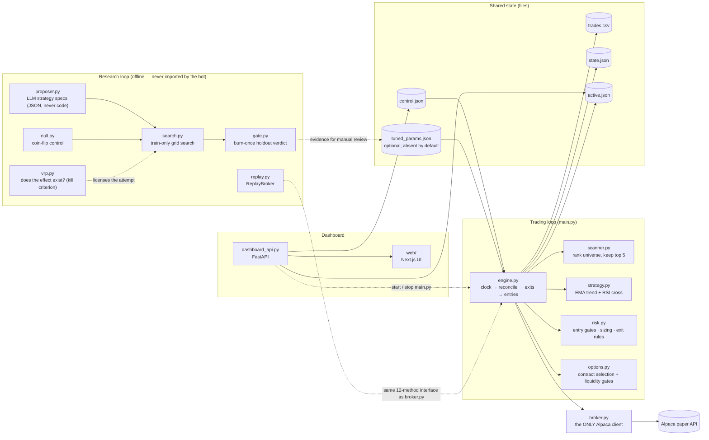

# Options Research Harness

[](https://github.com/Manideep728/options-research-harness/actions/workflows/ci.yml)

An options trading bot on an Alpaca paper account, and the offline harness that
checks whether its own backtest is lying to it.

I found a bug in the harness after it had already searched 986 strategy
configurations. It had reported a plausible result for every one of them, and
all of them were wrong. The cause was four lines in the simulator's exit loop.

## The two findings

**1. The backtest manufactured its own edge.** When a simulated price crossed a
stop or take-profit barrier, `bot/simulator.py` booked the bar's full return
instead of the barrier level. Losses were floored at −100% and gains were not,
so symmetric price noise came out as positive expectancy with no forecast
involved. Isolating the floor put it at roughly 31 percentage points of the
phantom edge. (That was a one-off ablation; the unfloored variant is no longer
in the code, so the 31 figure is not something you can regenerate here.)

Nothing in the repo had ever checked whether a random signal earns zero.
`research/null.py` does that now, and it rejects rather than reports:
`research/search.py` fails any winner that does not clear the coin flip's 95th
percentile.

→ [The full postmortem](docs/postmortem.md) covers the bug, the test that
catches it, and four more defects the same audit turned up.

**2. The premium is real, but no timing rule beat just collecting it.** With the
simulator fixed, I pre-registered one thesis and tested it: sell the variance
risk premium. `python -m research vrp` measures +3.79 volatility points on
VIX/SPY against a 0.56 cost hurdle, positive on 84.3% of days.

I then measured three entry rules against a structure-matched control. All three
were rejected. The control on its own earns +0.70% to +0.82% per trade and none
of the rules beat it, which suggests the premium is payment for holding a risk
rather than something a timing rule can capture.

Those figures come from a recorded run, not from a fresh clone. `research/data/`
is gitignored because the bar cache is large and re-fetchable, so reproducing
them means running `python -m research vrp --fetch` with your own Alpaca keys
first. The three-rule comparison is written up in the doc below, but its table
is not backed by committed data either.

→ [The variance risk premium arc](docs/variance-risk-premium.md) has the kill
criterion, the three defects that made the simulator unusable for this question,
and the verdict.

**Paper trading only.** The broker client is hard-wired to Alpaca's paper
endpoint; `paper=True` is a literal in `bot/broker.py`, not a setting. Nothing
here is financial advice, and the live strategy has no demonstrated edge. It has
completed only a handful of round trips, all of them losers, and `trades.csv` is
gitignored, so that is not something you can verify from the repo. The risk caps
exist to limit the damage until I have more data. The burn-once holdout gate has
never been run.

## The registry counts

`research/trials.jsonl` is append-only and committed. Every configuration I have
ever tested is logged there, because the deflated Sharpe ratio in
`research/metrics.py` takes the total number of attempts as an input. The counts
are stated here once and the other pages link back rather than restating them.

| figure | value | what it means |
|---|---:|---|
| Unique trials when the bug was found | **986** | 987 rows, all before the first `dataset_change` marker. This is the number the postmortem is about. |
| Unique trials today | **1,160** | Across 1,164 rows: 1,162 trials and 2 `dataset_change` markers. |
| Unique trials on the current model | **174** | Logged after the most recent marker. Only these estimate the deflated Sharpe's variance. |

Nothing is ever deleted. Trials measured on a P&L model that was later replaced
still count toward `N`, because they were real chances to get lucky. A
`dataset_change` row marks them as non-comparable to what came after. You can
reproduce the table with:

```powershell
.venv\Scripts\python -c "from research import registry; print(registry.trial_count())"
```

## Quickstart

```powershell
python -m venv .venv
.venv\Scripts\pip install -r requirements-dev.txt   # runtime + test/lint tooling
copy .env.example .env                              # then add your paper keys
.venv\Scripts\python main.py                        # DRY_RUN=true by default
```

```bash
python3 -m venv .venv
.venv/bin/pip install -r requirements-dev.txt
cp .env.example .env
.venv/bin/python main.py
```

Free paper keys come from https://alpaca.markets, under Paper Trading, where you
generate an API key pair. `DRY_RUN=true` runs the whole pipeline against real
market data and logs orders without submitting them. Start there.

→ [Operations](docs/operations.md) goes through setup in more detail, plus the
dashboard and the guarded self-tuner.

## Architecture



`bot/engine.py` never imports Alpaca. It depends only on a duck-typed broker
object, 12 methods wide. `research/replay.py` implements those same 12 methods
against the CSV bar cache, which lets the backtest drive the real
`Engine.run_cycle()`, with the real risk gates, scanner and contract selection
running inside it, and no changes to the engine at all.

→ [Architecture](docs/architecture.md) lists the broker interface, the strategy
rules and the file-by-file layout.

## Tests

```powershell
.venv\Scripts\python -m pytest tests -q   # 380 tests
.venv\Scripts\python -m ruff check .      # lint
.venv\Scripts\python -m mypy              # type check
cd web; npm run lint; npm run build       # frontend
```

CI runs all five of these on every push to `main` and on every pull request.
There is roughly one test file per module. If you only read a few, read the ones
listed below; `test_regime_guard_rejects_a_coin_flip` is the regression test for
the whole audit.

→ [Tests and quality gates](docs/tests.md) walks through the eleven tests that
pin the findings, and summarizes what the rest cover.

## How this was built

This repo was written with AI assistance. The direction, the review and the
decision to distrust the output were mine.

`research/proposer.py` is where that shows up in code. An LLM can propose
strategies, but only as JSON specs drawn from the fixed block vocabulary in
`research/blocks.py`, with every parameter clamped to a bounded range. It cannot
emit code. Each proposal is validated, logged to the committed registry and
counted in `N`, so a model that fires off a hundred ideas raises the statistical
bar its own winner has to clear.

That is also how the original bug surfaced. The tooling produced 986 plausible
results, and the control it was missing is what showed they were wrong.

## Documentation

| page | what is in it |
|---|---|
| [Postmortem](docs/postmortem.md) | The simulator bug, the coin-flip test, four more defects, and the headline result being withdrawn. |
| [Variance risk premium](docs/variance-risk-premium.md) | The pre-registered kill criterion, and why all three timing rules were rejected. |
| [Architecture](docs/architecture.md) | Broker interface, replay, strategy rules, file layout. |
| [Research loop](docs/research-loop.md) | The `fetch → search → null → replay → robustness → gate` cycle and its guardrails. |
| [Operations](docs/operations.md) | Setup, running the bot, the dashboard, the guarded self-tuner. |
| [Tests](docs/tests.md) | What the 380 tests cover, and which ones pin the findings. |

## License

MIT, see [LICENSE](LICENSE).
