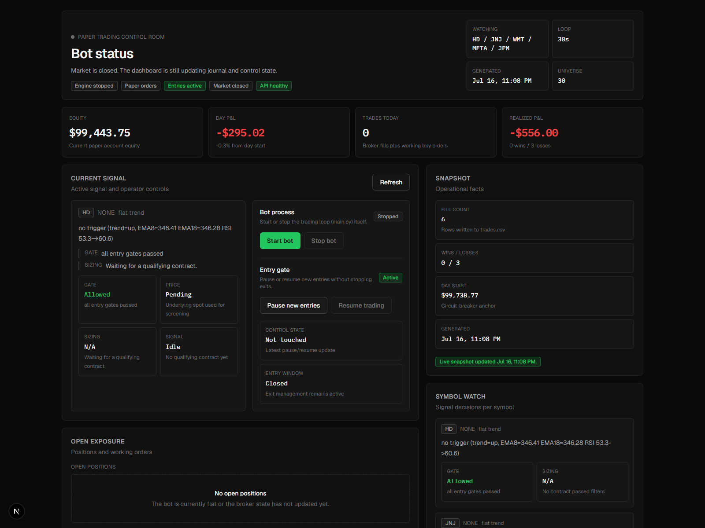

# Architecture

> Part of [trading_bot_new](../README.md).

The diagram is in the [README](../README.md#architecture); this page is the prose behind it.

## One broker interface, two implementations

There was a second problem, structural rather than arithmetic: **the backtest
tested a different system than the one that trades.**

`simulate()` reads 8 of the ~40 fields in `Settings`. It knows the signal and
the exits. It has never known about `max_positions` (3), `max_trades_per_day`
(3), `max_positions_per_underlying`, `signal_cooldown_sec` (30 min),
`active_list_size` (only 5 of 30 names are ever polled),
`skip_open_minutes`/`skip_close_minutes`, the earnings blackout,
`min_open_interest`, or `max_spread_pct_of_mid`.

The fix needed no rewrite, because `bot/engine.py` was already built for it:

> Depends only on the broker interface (duck-typed), never on alpaca directly,
> so the whole cycle is testable with a fake broker.
> — `bot/engine.py`, line 3

`tests/test_engine.py` already proved that interface is **11 methods** wide.
So `research/replay.py` implements the same 11 methods against the CSV bar cache,
and `Engine.run_cycle()` — the real one, with the real `bot/risk.py`,
`bot/scanner.py` and `bot/options.py` running inside it — becomes the thing
under test. A one-hour spike confirmed this before the class was written:
driving `run_cycle` off cached bars required **zero edits to `bot/engine.py`**.

```powershell
.venv\Scripts\python -m research replay --window val --compare
```
```
                trades   expectancy
simulate()         250       +5.81%     <- no caps, no cooldown, no shortlist
real engine         52      +35.03%     <- every risk gate active
```

The engine takes **20.8%** of the simulator's trades. Those are not two estimates
of one system; they are two systems, and the trade count is the point of the
table.

**The expectancy column is not evidence of an edge, and must not be read as
one.** It rests on 52 trades with no control to compare against, which is the
exact shape of claim the postmortem exists to reject. The research verdict
stands: no timing rule beats its matched null, and the live strategy has no
demonstrated edge.

Two invariants that file has to hold, both pinned by tests:

- **Causality.** `get_closes(symbol)` returns bars up to and including `now` and
  never one further, truncated to `bar_history_count` exactly as the live broker
  does. A leak here would be invisible and would make every result meaningless.
- **One P&L model.** Open positions reprice through
  `bot.simulator.option_return` — the same function `simulate()` uses. This is a
  transitional state, stated plainly: `simulate()` stays for fast grid search and
  should be deleted once replay is fast enough to search with. Two pricing models
  is the drift this module exists to remove.

What replay still does **not** model: real option quotes (the chain is
synthesized from `SimParams`, so no IV, no smile, no term structure); the
limit-order lifecycle, since buys fill at the ask whereas the live engine posts a
marketable limit and cancels it unfilled after 120s — so adversely-selected
non-fills are absent; partial fills; assignment; multi-contract sizing.

### A live-engine bug replay found on its first real run

`manage_exits` skipped any position with `current_price <= 0`, logging *"no
price; skipping exit check"*. The name was the bug. `get_option_positions`
prices at the bid and falls back to Alpaca's mark, so zero means neither exists
— the contract is dead, not unpriced. Because the guard `continue`d before
`risk.exit_reason` ran, **no** exit rule applied: not the stop, not the time
stop, not max hold. The position sat there holding one of three `max_positions`
slots until expiry — up to two weeks of the account's capacity, for nothing.

Fixed by falling through instead of skipping. `pnl_pct` is then −100%,
`exit_reason` returns the stop loss, and `close_option` **already** market-closes
when handed a bid of zero — that path existed and was simply unreachable. I had
first called this a trading decision needing a market-order design; that was
wrong, and reading `broker.py` instead of assuming would have caught it sooner.



## The execution target: an options bot

The thing the harness evaluates is a real, running bot. It watches a 30-name
universe with a **two-tier scan**: every 30 minutes it ranks the whole universe
for "likely to produce a tradeable signal soon" and keeps the top 5; every 30
seconds it polls just those 5, computes EMA/RSI, and — when the strict rules
line up — buys a single call or put with a marketable limit order, then manages
the exit. Long options only: maximum possible loss on any trade is the premium
paid.

## Strategy (defaults in `bot/config.py`, tunables in `tuned_params.json`)

**Universe & two-tier scan** — the watchlist is 30 names: ~10 liquid index/
sector ETFs plus ~20 mega-caps (for movement and to decorrelate the
shortlist). Scanning them all every 30 s would be slow, so:

- **Rank tier (every 30 min):** score all 30 on `score = trend_clarity ×
  rsi_proximity × recent_volatility` (`bot/scanner.py`) — "primed to fire"
  weighted by "actually moving." Keep the top 5 as the active shortlist.
- **Poll tier (every 30 s):** evaluate only those 5 for entries.
- **Trade cooldown:** once a signal fires on a `(symbol, action)` it is
  suppressed for `signal_cooldown_sec` (30 min), so a fast poll can't
  re-trigger the same setup every cycle.
- **Earnings blackout:** single names within `earnings_blackout_days` (±3) of
  earnings are dropped from the shortlist — an overnight earnings gap can open
  straight through the stop. Dates come from a hand-maintained `earnings.json`
  (see `earnings.example.json`); ETFs and unlisted symbols are never blacked
  out.

**Entry** — evaluated per shortlisted symbol on the latest closed 15-minute
bar:

| Condition | Buy CALL | Buy PUT |
|---|---|---|
| Trend filter | EMA-fast > EMA-slow | EMA-fast < EMA-slow |
| Trigger | RSI(14) crosses **up** through the bull level | RSI(14) crosses **down** through the bear level |

The default RSI levels are 45/55, not the textbook 30/70 — measured on a year
of real SPY/QQQ 15-minute data, RSI almost never reaches classic extremes
while the trend filter agrees; 35/65 produced literally zero signals.

Contract picked: nearest expiry within **7–14 DTE**, first strike OTM, and it
must pass liquidity gates (bid > 0, spread ≤ 10% of mid, open interest ≥ 100).
Entries use a **marketable limit** (mid + 1%, capped at the ask); exits sell
with a limit at the bid. Unfilled orders are canceled after 120 s.

**Exits** (checked every loop, priced on the **bid**, not the mark): take
profit **+50%**, stop loss **−25%**, time stop at **≤ 2 DTE**, max hold
**2 days** (entry time from the trade journal).

**Risk gates** (hard — the self-tuner cannot touch these): max 3 open
positions, 1 per underlying, premium ≤ 2% of equity, max 3 new trades/day,
and a **daily circuit breaker** that halts new entries if the account is down
4% from yesterday's close. No entries in the first/last 15 minutes.


## Layout

```
main.py            entry point (logging, config validation, loop start)
backtest.py        backtest / self-tune CLI
bot/config.py      every tunable + TUNABLE_BOUNDS + clamped tuned-param loading
bot/indicators.py  EMA / Wilder RSI (pure math)
bot/scanner.py     universe ranking: hybrid vol-weighted "primed" score (pure)
bot/strategy.py    signal logic (pure)
bot/earnings.py    earnings blackout gate + earnings.json loader
bot/options.py     contract selection + liquidity gates (pure)
bot/risk.py        entry gates, sizing, exit rules incl. max hold (pure)
bot/simulator.py   fast backtest engine + THE option P&L model (pure)
bot/pricing.py     Black-Scholes price, delta, vega, and credit-spread value (pure)
bot/tuner.py       guarded grid search + one chronological train/val split
bot/journal.py     trades.csv fill journal, FIFO realized P&L
bot/state.py       daily counters persisted to state.json
bot/watchlist.py   active shortlist persisted to active.json (engine -> dashboard)
bot/control.py     pause/resume flag shared with the dashboard
bot/dashboard.py   live snapshot builder for the dashboard API
bot/broker.py      the ONLY module that talks to Alpaca; DRY_RUN lives here
bot/engine.py      the loop: clock -> reconcile -> exits -> re-rank (due) -> poll shortlist -> sleep
dashboard_api.py   FastAPI backend for the web dashboard; also starts/stops main.py on request
run_dashboard.py   launches API + web frontend together (Python-side alternative to npm run dev)

research/data.py       bar cache, session filter, train/val/holdout splits + embargo
research/vrp.py        the variance risk premium: implied vs subsequent realized vol
research/families.py   built-in strategy families (directional + short premium)
research/blocks.py     the fixed block vocabulary an LLM proposal may combine
research/search.py     select-on-train grid search, registry-aware, null-gated
research/null.py       the coin-flip control every candidate is measured against
research/replay.py     ReplayBroker: the real engine driven over cached bars
research/registry.py   append-only trial log (committed: it is the honest denominator)
research/metrics.py    deflated Sharpe
research/robustness.py SimParams perturbation + daily regime check vs the null
research/gate.py       burn-once out-of-sample verdict
research/proposer.py   Claude proposes a spec (JSON, never code)

web/src/app/page.tsx              composition only
web/src/hooks/use-dashboard.ts    polling, actions, and all dashboard state
web/src/components/dashboard/     one file per panel + shared primitives
web/scripts/dev-with-api.js       npm run dev entrypoint: boots the API, then next dev
```
